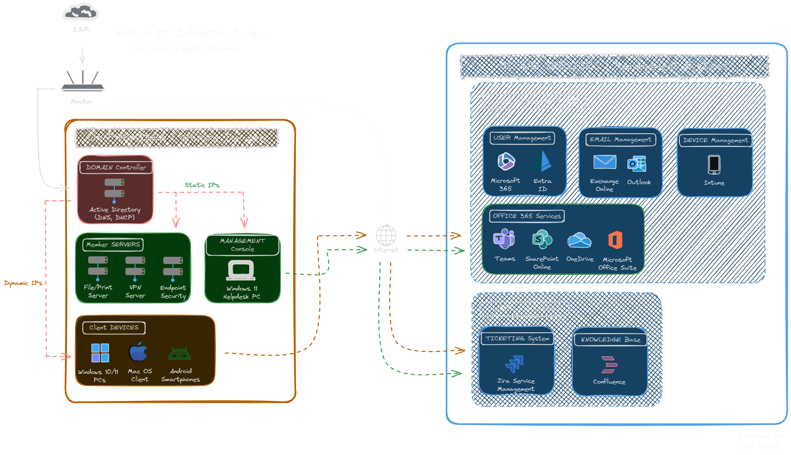
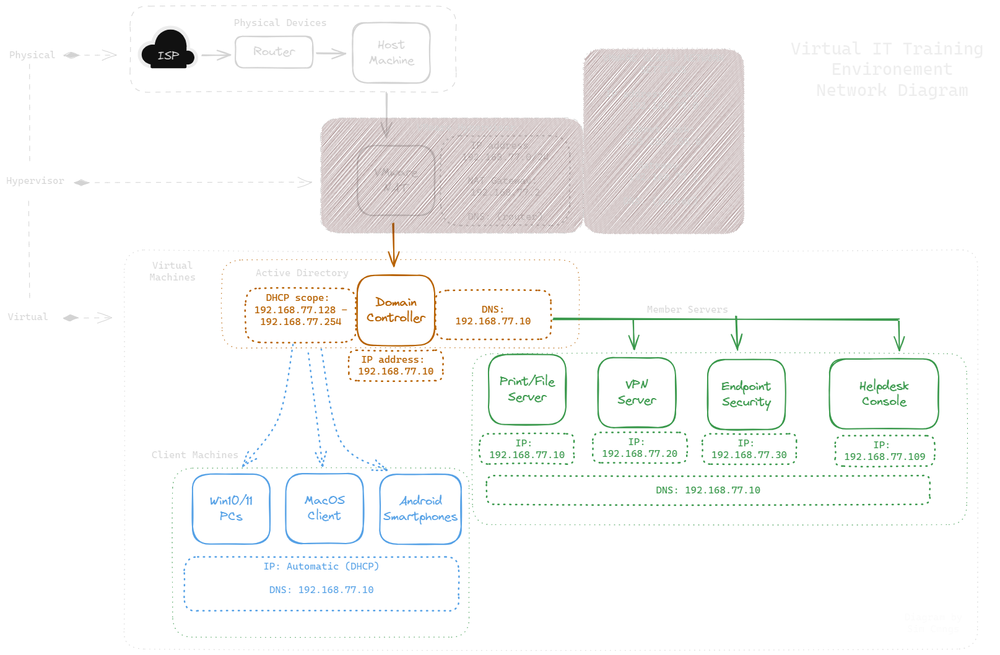

# Simulating a Service Desk Environment - for IT Support Training 

This project aims to provide *hands-on training* and *troubelshooting excercises* to **IT Support Trainees**, by building a realistic and scalable virtual environment, that mirrors an organisation's IT systems.



> This project was originally created as a troubleshooting lab for my own professional development, but  has been adapted to work within the context of a hypothetical service desk environment.

## 🛠 Tools & Technologies:

<table>
  <tr>
    <th>Virtualization & Systems</th>
    <th>Networking & Security</th>
  </tr>
  <tr>
    <td>
      
      
      
      
      
   </td>
    <td>
      
      
      
      
      
      
      
    </td>
  </tr>
  <tr>
    <th>Admin/Management Systems</th>
    <th>Collaboration/Productivity</th>
  </tr>
  <tr>
    <td>
      
      
      
      
      
    </td>
    <td>
      
      
      
      
      
   </td>
  </tr>
  <tr>
    <th>Scripting & Automation</th>
    <th>Remote Desktop Support</th>
  </tr>
  <tr>
    <td>
      
    </td>
    <td>
      
      
      
      
   </td>
  </tr>
    <tr>
    <th>Ticketing System</th>
    <th>Documentation</th>
  </tr>
  <tr>
    <td>  
         
      
   </td>
    <td>
       
      
      
      
      
    </td>
  </tr>
</table>

<details><summary>Tools & Technologies - LISTED</summary>

> - **Virtualization & Systems:** `VMware` , `Windows 10/11` , Windows `Server OS` , `Mac OS` , `Android`
> - **Networking & Security:** `TCP/IP` , `DNS/DHCP` , `VPN` , `Firewalls`, `Symantec` Endpoint Security (Antivirus)
> - **Management Systems:** `Microsoft 365/Entra ID` , `Active Directory` , `Exchange` Online , `Intune` (MDM)
> - **Collaboration/Productivity:** `Outlook` , `Teams` , `SharePoint` Online , `OneDrive` , `MS Office` Suite
> - **Scripting/Automation:** `PowerShell`
> - **Remote Support:** `TeamViewer` , `Quick Assist` , `RSAT` , `RDP`
> - **Ticketing System:** `Jira` Service Management
> - **Documentation:** Project Writing (`markdown / HTML`) , `Diagramming` , Troubleshooting Instructions/Support Guides , Video Tutorials

</details>
  
---

# Introduction

The **IT Manager** has noticed a concerning decline in customer satisfaction rates, with feedback of: 
- High **Ticket Escalation rates**
- Prolonged **Resolution times**
- Missed **Service Level Agreement** (SLA) **targets**

> These metrics were the result of the **1st Line Support team** coming from external training programs, putting a <ins>focus on theory rather than hands-on expeirence</ins>.
>
> This lack of hands-on experience left trainees <ins>unable to troubleshoot and resolve</ins> a wide range of cusomter's issues, which negatively affected our service desk's operational and support quality.

---

## ⛔ Problem Statement:
Challenges of the service desk included:

- ❌ Frequent escalation to higher-level support engineers
  - *(metric affected: low first contact resolution rates ~ FCRs)*
- ❌ Backlog of unresolved support tickets
  - *(metric affected: prolonged resolution times ~ TTRs)*
- ❌ Declining customer satisfaction scores
  - *(measured from: negative customer reviews and surveys)*

## 💡 Solution:

To address these challenges, the **IT manager** tasked me with developing a <ins>virtual Support Training environment</ins> that mimics our current IT systems.

> This will provide trainees with a safe, controlled platform to **develop their troubleshooting skills** and **gain practical experience**, better preparing them for the realities of our live service environment.

Core technologies/devices to include:

- ✔️ #1. Virtual **Servers** - *(Vmware)* 

<details><summary>⚙️ - {{{click for more info}}}</summary>

   - <ins>**Domain** Controller</ins>:
     - *on-premises Active Directory environment*
   - <ins>**File/Print** Server</ins>:
     - *file sharing and print management*
   - <ins>**VPN** Server</ins>:
     - *secure-remote access to company resources*
   - <ins>Endpoint **Security**</ins>:
     - *Symantec's 'endpoint-managed' antivirus solution*

</details>

- ✔️ #2. Virtual **Workstations** - *(Vmware)*

<details><summary>🖥️</summary>

   - <ins>**Helpdesk** PC</ins>:
     - *dedicated workstation for IT support staff, with Remote Admin Tools (RSAT)*
   - <ins>**Windows** 10/11 PCs</ins>:
     - *majority of the end-user's devices*
   - <ins>**Mac OS** Client</ins>:
     - *catering to the the needs of the Art and Design teams*
   - <ins>**Android** Smartphones</ins>:
     - *for mobile device management training*

</details>

- ✔️ #3. Cloud **Management Systems** - *(Microsoft 365)*   

<details><summary>☁️</summary>

   - <ins>**User** Management</ins>:
     - *Microsoft 365/Entra ID - access management to resources/applications*
   - <ins>**Email** Management</ins>:
     - *Exchange Online - administration of users' Outlook accounts*
   - <ins>**Device** Management</ins>:
     - *Intune - practicing device enrollmment and policy enforcement*
   - <ins>**Office 365** Services</ins>:
     - *Teams, SharePoint Online, OneDrive, and MS Office Suite*

</details>

- ✔️ #4. **Ticketing** Software - *(Cloud Instance)*

<details><summary>💬</summary>

   - <ins>**Jira** Service Management</ins>:
     - *central platform for logging, prioritising and escalating support tickets*
   - <ins>**Confluence**</ins>:
     - *knowledge base, for public-facing users guides and FAQs*

</details>

---

# 💻 Implementation:

### 1️⃣ Planning and Design:

#### <ins>**1.1 - Scope and Requirements**</ins>

<details><summary>Features and Functions</summary>
  
1. **Virtual Servers**  

>   - **Domain Controller**: *manage user accounts, group policies, and network authentication*
>   - **Print/File Server**: *centralised file storage/print services*
>   - **VPN Server**: *secure access to the internal network*
>   - **Endpoint Security**: *protects client devices from malware/security threats*

2. **Client Workstations**   

>   - **Helpdesk PC**: *remote management of client devices*
>   - **Windows 10/11 Clients**: *end-user devices*
>   - **Mac OS Client**
>   - **Android Smartphones**: *mobile devices*

3. **Management Systems**  

>   - **Microsoft 365/Entra ID**: *manage cloud-user identites*
>   - **Exchange Online/Outlook**: *email services*
>   - **Intune**: *manage mobile devices*

4. **Ticketing Software**

>   - **Jira Service Management**: *IT support service, incident management and knowledge base platform.*

</details>

<details><summary>Costs</summary>

   <ins>**Licenses**</ins>
   - Microsoft 365 E5 
   - Symantec Endpoint Security 

   <ins>**Domain Name**</ins>
   - vgmlab *(Hostinger/GoDaddy)*

   <ins>**Operating Systems**</ins>
   - Windows Server licenses
   - Windows 10/11 licenses
   - macOS 13 license

</details>

<details><summary>Resources</summary>

   <ins>**Host Machine specs**</ins>:
   - **CPU**: High-performance processor, *Minimum* 12 cores
   - **RAM**: *Minimum* 64GB
   - **Storage**: *Minimum* 16TB, SSD 
   - **Networking**: Gigabit Ethernet connectivity, Fiber-optic

</details>

---

#### <ins>**1.2 - Infrastructure Diagrams**</ins>

<details><summary>Network Diagram</summary>



</details>

<details><summary>Virtual Machine Configurations</summary>

```yaml
+---------------------------+
|   Virtual Machine (VM)   |
|      Configurations      |
+---------------------------+


+-------------------------------+  
|        Domain Controller     |  
| (Windows Server 2022)        |  

| Hardware:                    | 
| - 2 vCPUs                    |  
| - 4GB RAM                    |  
| - 80GB Disk                  |  

| Software & Services:         |  
| - Active Directory Domain    |  
|   Services                   |  
| - DNS Server                 | 
| - DHCP Server                |  
+-------------------------------+  


+-------------------------------+  +-------------------------------+  +-------------------------------+
|        File/Print Server     |  |           VPN Server         |  |      Endpoint Security      |
| (Windows Server 2022)        |  | (Windows Server 2022)        |  | (Windows Server 2022)       |

| Hardware:                    |  | Hardware:                    |  | Hardware:                   |
| - 2 vCPUs                    |  | - 2 vCPUs                    |  | - 2 vCPUs                   |
| - 4GB RAM                    |  | - 4GB RAM                    |  | - 4GB RAM                   |
| - 100GB Disk (Expandable)    |  | - 80GB Disk                  |  | - 80GB Disk                 |

| Software & Services:         |  | Software & Services:         |  | Software & Services:        |
| - Distributed File System    |  | - IIS Web Server             |  | - Symantec Endpoint         |
| - Backup & Restore           |  | - Remote Access              |  |   Protection                |
| - Print and Document         |  | - Direct Access and VPN      |  |                             |
|   Services                   |  |                              |  |                             |
+-------------------------------+  +-------------------------------+  +-------------------------------+


+-------------------------------+  
|        Helpdesk PC           |  
| (Windows 11)                 |  

| Hardware:                    | 
| - 2 vCPUs                    |  
| - 8GB RAM                    |  
| - 80GB Disk                  |  

| Software & Services:         |  
| - RSAT: Remote Admin Tools   |  
| - TeamViewer                 |  
| - Microsoft Support and      |
|   Recovery Assistant         | 
| - Visual Studio Code         |  
| - Microsoft Office 365       |
+-------------------------------+  


+-------------------------------+  +-------------------------------+
|    PC Client Workstations    |  |   MAC Client Workstation     |
| (Windows 10/11)              |  | (macOS 13)                   |

| Hardware:                    |  | Hardware:                    |
| - 2 vCPUs                    |  | - 2 vCPUs                    |
| - 8GB RAM                    |  | - 8GB RAM                    |
| - 100GB Disk                 |  | - 120GB Disk                 |

| Software & Services:         |  | Software & Services:         |
| - Microsoft Office 365       |  | - Microsoft Office 365 (mac) |
| - Various Multimedia         |  | - Adobe Creative Cloud       |
|   Software                   |  | - Endpoint Protection        |
| - Endpoint Protection        |  |                              |
+-------------------------------+  +-------------------------------+


```

</details>

---

#### <ins>**1.3 - Active Directory Implementation**</ins>

<details><summary>Active Directory "OU Structure" Design</summary>

```yaml
Domain/
├── VgmLab Admins:
│   ├── Domain Admins/
│   ├── Server Admins/
│   └── Workstation Admins/

├── VgmLab Computers:
│   ├── Client Workstations_MAC/
│   ├── Client Workstations_PC/
│   └── Helpdesk Workstations/

├── VgmLab Groups:
│   ├── access_Administrative-Control/
│   ├── access_Applications/
│   ├── access_Printers/
│   ├── access_ShareFiles/
│   ├── disable_System-Apps/
│   └── map_Network-Drives/

├── VgmLab Servers:

└── VgmLab Users:
    ├── Art/
    ├── Audio/
    ├── Design/
    ├── IT/
    ├── Production/
    ├── Programming/
    ├── QA/
    └── Technical Art/
```
  
</details>

<details><summary>Active Directory "Group Policy (GPO)" Design</summary>

```yaml
Domain
├── GROUP POLICY: COMPUTER-Local-Admin-Permissions

├── OU- VgmLab Admins
│   ├── Sub OU- Domain Admins
│   ├── Sub OU- Server Admins
│   └── Sub OU- Workstation Admins
│       ├── GROUP POLICY: USER-Map-Network-Drives
│       └── GROUP POLICY: USER-Access-Shared-Printers

├── OU- VgmLab Computers
│   ├── GROUP POLICY: COMPUTER-Network-Discovery-enable
│   ├── Sub OU- Client Workstations_MAC
│   ├── Sub OU- Client Workstations_PC
│   │   └── GROUP POLICY: COMPUTER-BlockAccess-to-Applications
│   └── Sub OU- Helpdesk Workstations

├── OU- VgmLab Groups
│   ├── Sub OU- access_Administrative-Control
│   ├── Sub OU- access_Applications
│   ├── Sub OU- access_Printers
│   ├── Sub OU- access_ShareFiles
│   ├── Sub OU- disable_System-Apps
│   └── Sub OU- map_Network-Drives

├── OU- VgmLab Servers

└── OU- VgmLab Users
    ├── GROUP POLICY: USER-Map-Network-Drives
    ├── GROUP POLICY: USER-Deploy-App
    ├── GROUP POLICY: USER-Access-Shared-Printers
    ├── Sub OU- Art
    ├── Sub OU- Audio
    ├── Sub OU- Design
    ├── Sub OU- IT
    ├── Sub OU- Production
    ├── Sub OU- Programming
    ├── Sub OU- QA
    └── Sub OU- Technical Art

```

</details>

<details><summary>Active Directory "File Shares (NTFS)" Layout</summary>

```yaml
Folders/
├── Art_data:
│   ├── Concept Art/
│   ├── Character Art/
│   ├── Environment Art/
│   ├── UI Art/
│   └── Marketing Art/

├── Audio_data:
│   ├── Music/
│   ├── Sound Effects/
│   └── Voiceovers/

├── Design_data:
│   ├── Game Design Documents/
│   ├── Level Design/
│   ├── Narrative Design/
│   └── User Interface Design/

├── IT_data:
│   ├── User Profiles
│   ├── Software
│   ├── Scripts
│   ├── Backups
│   ├── Security Logs
│   └── Documentation

├── Production_data:
│   ├── Project Management/
│   ├── Schedules/
│   ├── Budgets/
│   └── Marketing Plans/

├── Programming_data:
│   ├── Source Code/
│   ├── Libraries/
│   ├── Tools/
│   ├── Assets/
│   └── Documentation/

├── QA_data:
│   ├── Test Plans/
│   ├── Bug Reports/
│   └── Playtesting Feedback/

└── Technical Art_data:
    ├── Shaders/
    ├── Lighting/
    ├── Particles/
    └── Animation/
```

</details>

---

### 2️⃣ Deployment / Configuration:

#### <ins>**2.1 - VMware Environment Setup**</ins>

> - Created and configured the virtual machines *(on-prem servers and devices)*.
> - Installed operating systems and required services/applications.
> - Established networking and connectivity between virtual machines.

<details><summary>VMware Setup - Deployment Checklist</summary>

## 1 - **PRE-DEPLOYMENT** CHECKLIST

 - [x] VMware - *installed and up-to-date* ✔️
 - [x] Download Windows Server + Windows 10/11 ISO files ✔️
 - [x] Allocate system resources *(CPU, RAM, Storage)* ✔️
 - [x] Plan network configuration *(IP addressing, subnets, etc.)* ✔️

## 2 - **DEPLOYMENT** STEPS

### 1. <ins>Create **Windows Server** VMs</ins>

> - Operating System: Windows Server 2019/2022
> - Allocate 2 vCPUs, 4GB RAM, 80GB Storage
> - Configure network settings *(static IP, DNS, etc.)*

### 2. <ins>Install **Active Directory** Domain Services</ins>
   
> - Open Server Manager / add the "Active Directory Domain Services" role
> - Promote server to a domain controller
> - Configure domain name *("vgmlab.uk")*

### 3. <ins>Configure **Member Servers**</ins>
 
> - Join Member Servers to the Active Directory domain 
> - Configure Server roles *(File/Print, VPN)*
> - Setup Symantec Endpoint Security solution

### 4. <ins>Run **PowerShell** scripts</ins>

> - Bulk import OUs, Security Groups, and Users - *BulkImportUsersGroupsOus.ps1*
> - Assign group memberships to users - *AddUsersToSecurityGroups.ps1*
> - Create file shares and set permissions - *CreateFileSharesAndPermissions.ps1*

### 5. <ins>Create **Windows 10/11 Client** VMs</ins>

> - Operating System: Windows 10/11
> - Allocate 2 vCPUs, 8GB RAM, 100GB Storage
> - Join the client VMs to the Active Directory domain
  
### 6. <ins>Test **Active Directory** Integration</ins>
   
> - Log into client VMs, using domain credentials
> - Verify user and group management
> - Test file sharing and group policy application
   
### 7. <ins>**Snapshot** the VMs</ins>

> - Take snapshots of the domain controller, member servers and client VMs
> - Test snapshots - *can be easily reverted for lab resets*

## 3 - **VALIDATION** CHECKLIST

- [x] Windows Server VMs ✅ - operational 
- [x] Active Directory Domain Services ✅ - *installed and configured*
- [x] Windows 10/11 client VMs ✅ - *joined to the domain*
- [x] User and group management, file sharing, and group policy ✅ - *working as expected*
- [x] Snapshots of VMs taken ✅ - *for easy lab reset*

</details>

<details><summary>Active Directory - PowerShell Scripts</summary>

`PowerShell` -scripts

[BulkImportUsersGroupsOus.ps1](BulkImportUsersGroupsOus.ps1)

[AddUsersToSecurityGroup.ps1](AddUsersToSecurityGroup.ps1)

[CreateFileSharesAndPermissions.ps1](CreateFileSharesAndPermissions.ps1)

</details>

---

#### <ins>**2.2 - Cloud Management Integration**</ins>

> - Provisioned the Microsoft 365/Entra ID tenant to manage user accounts.
> - Configured Exchange Online to manage clients' Outlook email accounts.
> - Enrolled selected virtual machines/smartphones to Intune for remote device management.

<details><summary>Microsoft 365 - PowerShell Commands</summary>

```powershell

# Install and import Microsoft.Graph module
Install-Module Microsoft.Graph -Force
Set-ExecutionPolicy RemoteSigned -Scope Process -Force
Import-Module Microsoft.Graph

# Connect to Microsoft Graph API
Connect-MgGraph -Scopes "Directory.AccessAsUser.All"

# Define the path to the .csv file
$csvPath = "C:\path\to\your\file.csv"

# Import the .csv file
$users = Import-Csv -Path $csvPath

# Create new Microsoft 365 users and store users' information in variables
$userIds = @()
foreach ($user in $users) {
    $newUserParams = @{
        UserPrincipalName          = $user.Username + "@example.com"  # Use your verified domain name here
        DisplayName                = $user."Display name"
        GivenName                  = $user."First name"
        Surname                    = "Lastname"  
        AccountEnabled             = $true
        MailNickname               = $user.Username  # Use the Username field as mailNickname
        Department                 = "YourDepartment"  # Optional: Add any other user properties you want to set
        PasswordProfile            = @{
            Password                = "Passw0rd!"  # Replace with the actual password for the user
            ForceChangePasswordNextSignIn = $true  # Optional: Set to $true if you want the user to change their password at the next sign-in
        }
    }
    
    $newUser = New-MgUser @newUserParams
    $userIds += $newUser.Id
}

# Assign users' usage location
$userIds | ForEach-Object {
    Update-MgUser -UserId $_ -UsageLocation "GB"
}

# Retrieve license information
$subscription = Get-MgSubscribedSku -All | Where-Object { $_.SkuPartNumber -eq "SPE_E5" }
$addLicenses = @(@{ SkuId = $subscription.SkuId })

# Assign E5 licenses to users
$userIds | ForEach-Object {
    Set-MgUserLicense -UserId $_ -AddLicense $addLicenses -RemoveLicenses @()
}

# Create a new Microsoft 365 group
# Rename/Replace [Group Name], [Description], [groupname]
$newGroup = New-MgGroup -DisplayName "[Group Name]" -Description "[Description]" -MailEnabled:$False -MailNickName '[groupname]' -SecurityEnabled

# Add users to the group
$userIds | ForEach-Object {
    New-MgGroupMember -GroupId $newGroup.Id -DirectoryObjectId $_
}

```

</details>

---

#### <ins>**2.3 - Cloud Services Setup**</ins>

> - Set up Teams, for virtual collaboration *(video conferencing and voice calls)*
> - Integrated OneDrive, for *cloud storage and file sharing*
> - Configured SharePoint Online, as the Support Team's *document management system for internal knowledge sharing*
> - Deployed Microsoft Office suite applications to enrolled devices using Intune

---

#### <ins>**2.4 - Ticketing System Implementation**</ins>

> - Created a Jira Service Management cloud instance, *using a custom domain & company email address*
> - Set up the ticketing system, *including a cutomer portal with custom issue types*.
> - Assigned agent/customer roles and permissions, *for Team Members/End-Users*.
> - Set up the Confluence knowledge base, *for customer-facing user guides and FAQs*.

---

### 3️⃣ Training + Simulation Exercises:

#### <ins>**3.1 - Training Exercises**</ins>
 - Designed a set of realistic IT support scenarios to be used as hands-on training exercises.

<details><summary>#1 - Onboarding and Managing [user accounts]</summary>

      Exercise #1: Onboard new users into Active Directory
      > Tools: with RSAT-ADUC Console
      > Tasks: configure user properties/home folders, assign group memberships, and map network drives

      Exercise #2: Automate user account management tasks
      > Tools: using CSV files, and PowerShell commands   
      > Tasks: provision accounts, assign licenses, and set users' location

      Exercise #3: Resolve login issues and password resets
      > Tool: with RSAT-ADUC Console
      > Tasks: unlock user accounts, and reset passwords

</details>

<details><summary>#2 - Troubleshooting and Testing [network connections]</summary>

      Exercise #1: Troubleshoot network connectivity issues
      > Tools: with Device Manager, and CMD commands (ipconfig, ping, netsh)
      > Tasks: troubleshoot network issue with admin tools, configure TCP/IP addressing, enable DHCP service

      Exercise #2: Resolve DNS resolution failures ("Domain could not be contacted" error)
      > Tool: with CMD commands (nslookup, ping, flushdns)
      > Tasks: test name resolution functionality with system tools, add/modify DNS records

      Exercise #3: Configure VPN access for remote users
      > Tools: with VPN server and SSL certificate
      > Tasks: configure VPN connection settings, install security certificate, autheticate remote users

</details>

<details><summary>#3 - Resolving [printer and file] sharing issues</summary>

      Exercise #1: Set up a shared network printer
      > Tools: with Server Manager, and Device Management
      > Tasks: remote into virtual server, install printer driver, configure sharing settings, test connection

      Exercise #2: Resolve restrictive access to share files
      > Tools: with NTFS permissions, and security groups
      > Tasks: access security settings, review and modify file permissions

      Exercise #3: Train users to share project files with permissions
      > Tools: using OneDrive for Work
      > Tasks: access sharing settings, modify access permissions, generate URL link/send email 

</details>

<details><summary>#4 - Deploying and Managing [security] solutions</summary>

      Exercise #1: Deploy endpoint antivirus packages, to client devices
      > Tools: with Symantec Endpoint Security manager
      > Tasks: create deployment package, prepare client devices, remote-push installation 

      Exercise #2: Implement firewall policies
      > Tools: with Windows Defender Firewall
      > Tasks: configure rules to allow/block network traffic, websites and applications

      Exercise #3: Set up MFA sign-in for users
      > Tools: using Microsoft 365 admin center, and MS Authenticator App
      > Tasks: enable Multi-factor Authetication, set up authenticator app on smartphone, verify sign-in method

</details>

<details><summary>#5 - Responding to [email]-related problems</summary>

      Exercise #1: Troubleshoot mail flow / delivery failures
      > Tools: with Exchange Online, and Outlook
      > Tasks: trace messages, create security and email delivery rules

      Exercise #2: Prevent phising/junk mail and block malware attachments
      > Tools: with Exchange Online
      > Tasks: create security rules, and test/verify rules are working

      Exercise #3: Train users to implement email management processes
      > Tools: for Outlook
      > Tasks: create tags, and rules to automatically sort emails into organised folders

</details>

<details><summary>#6 - Handling [mobile device] management tasks</summary>

      Exercise #1: Enroll/Deploy devices for remote management
      > Tools: with Intune admin center, and Windows Autopilot
      > Tasks: set up deployment profiles, import hardware ID, auto-enroll or deploy devices

      Exercise #2: Create device-compliant policies
      > Tools: with Intune
      > Tasks: configure policies (eg. security requirements), and assign policies to enrolled devices

      Exercise #3: Deploy applications to remote devices
      > Tools: with Intune
      > Tasks: select/package apps, configure app installation settings, and deploy apps to devices

</details>

<details><summary>#7 - Providing [Office 365] technical support </summary>

      Exercise #1: Microsoft Teams support
      > Tasks: set up hardware equipment (webcams, headsets), and guide users on Teams' features 
               (background noise supression, screen sharing, virtual backgrounds)

      Exercise #2: SharePoint Online support
      > Tasks: build a communication site, manage user permissions, develop content (document library, etc)

      Exercise #3: Office Suite support (Word/Excel/PowerPoint)
      > Tasks: recover unsaved docs, repair/reinstall office apps, configure settings to meet users' preferences

</details>

---

## 📊 Results:
The updated process for creating support documentation with **AI-Scribe**, achieved the following results:
- 📚 **Optimized Documentation Process**
>    - (AI-generated user guides, will automate the enitre process, <ins>eliminating the need to manually take screenshots</ins>, edit them, <ins>and add step instructions</ins>).
    
- 📉 **Reduced Support Ticket Volume**
>    - (Integration of visual-aids, will provide a more intuitive understanding of instructions, <ins>empowering users to resolve issues for themsleves</ins>).
    
- 😊 **Improved User Satisfaction**
>    - (Cloud-hosted support docs, will enable automatic updates, giving users access to the most accurate information, resulting in <ins>fewer errors during troubleshooting.</ins>).

---

## 🎉 Conclusion:
Automating support docs with AI-powered Scribe resulted in a streamlined documentation process, enhanced user experience, and improved version control.

---
